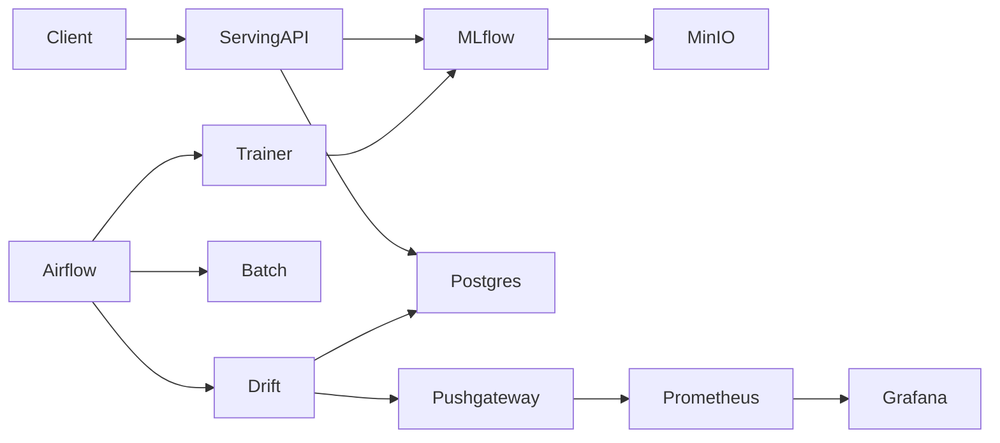

# Cloud-Native MLOps Model Lifecycle Platform

A **cloud-native MLOps platform** demonstrating the full **machine learning lifecycle** on Kubernetes, including training, model registry, deployment, batch scoring, drift detection, and observability.

---

# Architecture Overview

This platform implements an **end-to-end ML lifecycle loop**:

**Train → Register → Deploy → Serve → Monitor → Detect Drift → Retrain**



---

# Platform Components

| Component                   | Purpose                                                   |
| --------------------------- | --------------------------------------------------------- |
| **Airflow**                 | Orchestrates training, batch scoring, and drift detection |
| **MLflow**                  | Experiment tracking and model registry                    |
| **MinIO**                   | S3-compatible artifact storage for models and datasets    |
| **PostgreSQL**              | Metadata store and prediction logging                     |
| **Serving API (FastAPI)**   | Real-time inference service                               |
| **Trainer Service**         | Trains models and registers them                          |
| **Batch Service**           | Runs batch inference jobs                                 |
| **Drift Detection Service** | Detects feature drift using PSI                           |
| **Prometheus**              | Metrics collection                                        |
| **Grafana**                 | Monitoring dashboards                                     |
| **Pushgateway**             | Push-based metrics from batch/drift jobs                  |

---

# Kubernetes Architecture

The platform runs inside **multiple Kubernetes namespaces**.

| Namespace        | Purpose                                     |
| ---------------- | ------------------------------------------- |
| `mlops-platform` | Control plane (Airflow, MLflow, monitoring) |
| `mlops-dev`      | Development workloads                       |
| `mlops-staging`  | Staging environment                         |
| `mlops-prod`     | Production serving                          |

---

# ML Lifecycle

1️⃣ **Training**

Airflow launches a Kubernetes trainer job.

* Loads dataset
* Trains model
* Logs experiment to MLflow
* Registers model in MLflow registry
* Stores artifacts in MinIO

---

2️⃣ **Model Serving**

Serving API:

* Loads **Production model from MLflow**
* Performs inference
* Logs predictions to PostgreSQL
* Exposes Prometheus metrics

---

3️⃣ **Batch Scoring**

Batch jobs:

* Load dataset from MinIO
* Run predictions
* Write results back to MinIO

---

4️⃣ **Drift Detection**

Drift jobs:

* Compare **recent prediction features** with **training reference statistics**
* Compute **PSI (Population Stability Index)**
* Send metrics to Prometheus via Pushgateway

---

# Repository Structure

```
.
├── airflow/                 # Airflow DAGs
├── infra/                   # Kubernetes manifests and Helm values
│   └── manifests/
├── services/
│   ├── serving/             # FastAPI inference service
│   ├── trainer/             # Model training service
│   ├── batch/               # Batch scoring service
│   └── drift/               # Drift detection service
├── scripts/
│   └── deploy_platform.sh   # Platform deployment script
└── docs/
```

---

# Synthetic Dataset

The project uses the **Scikit-Learn Breast Cancer dataset** as a synthetic example.

```
sklearn.datasets.load_breast_cancer()
```

Reference statistics generated during training are later used for **drift detection**.

---

# Deployment

The platform is designed to run on **Kubernetes (Minikube or Kind)**.

## Start cluster

```bash
minikube start
```

or

```bash
kind create cluster
```

---

## Deploy platform

```bash
./scripts/deploy_platform.sh
```

This deploys:

* Airflow
* MLflow
* PostgreSQL
* MinIO
* Prometheus
* Grafana

---

## Deploy services

```bash
kubectl apply -f infra/manifests/
```

---

# Observability

Metrics exposed include:

| Metric                       | Description                  |
| ---------------------------- | ---------------------------- |
| `prediction_requests_total`  | Number of inference requests |
| `prediction_latency_seconds` | Inference latency            |
| `feature_drift_psi`          | PSI drift score              |

Dashboards are available in **Grafana**.

---

# Architecture Patterns Used

### Cloud-Native Patterns

* Microservices architecture
* Control plane / data plane separation
* Kubernetes batch jobs
* Immutable deployments
* Observability-first design

### MLOps Patterns

* Model registry
* Automated retraining loop
* Feature drift monitoring
* Experiment tracking

---

# Python Patterns Used

* **Factory pattern** – model loading
* **Dependency injection** – service configuration
* **Repository pattern** – database access
* **Configuration via environment variables**
* **Modular service architecture**

---

# Key Design Goals

* Demonstrate **end-to-end MLOps lifecycle**
* Emphasize **architecture and scalability**
* Use **cloud-native tools**
* Support **multiple deployment environments**

---

# Future Improvements

* CI/CD pipeline integration
* Feature store
* Canary model deployments
* Automated retraining triggers
* Persistent object storage

---

## Documentation

Detailed architecture and design documents are available in the `/docs` folder.

| Document | Description |
|--------|-------------|
| [Architecture Design](docs/01_ARCHITECTURE_DESIGN.md) | System architecture, components, and infrastructure design |
| [ML Lifecycle](docs/02_ML_LIFECYCLE.md) | Training, serving, batch inference, and drift detection lifecycle |
| [Sequence Diagrams](docs/03_SEQUENCES.md) | End-to-end sequence flows for training, inference, and monitoring |
| [GenAI Session Logs](docs/04_GENAI_SESSION_LOGS.md) | Prompts and troubleshooting sessions using GenAI |

---

# License

This project is intended for **educational and architectural assignment purposes**.
