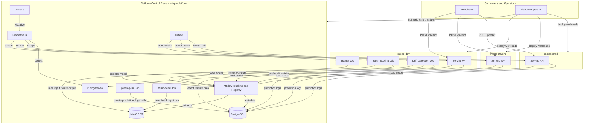
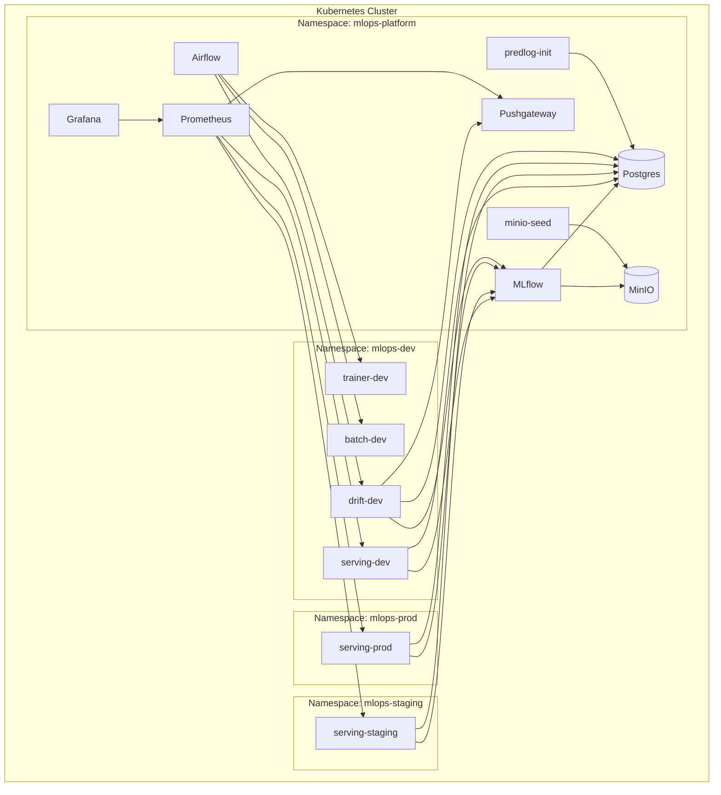
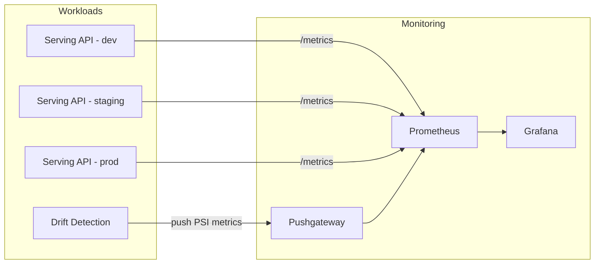

## System Architecture Diagram

```mermaid
flowchart TB

    subgraph Users[Consumers and Operators]
        C[API Clients]
        O[Platform Operator]
    end

    subgraph Platform[Platform Control Plane - mlops-platform]
        AF[Airflow]
        MF[MLflow Tracking and Registry]
        PG[(PostgreSQL)]
        MI[(MinIO / S3)]
        PR[Prometheus]
        GF[Grafana]
        PW[Pushgateway]
        J1[predlog-init Job]
        J2[minio-seed Job]
    end

    subgraph Dev[mlops-dev]
        SD[Serving API]
        TD[Trainer Job]
        BD[Batch Scoring Job]
        DD[Drift Detection Job]
    end

    subgraph Staging[mlops-staging]
        SS[Serving API]
    end

    subgraph Prod[mlops-prod]
        SP[Serving API]
    end

    O -->|kubectl / helm / scripts| Platform
    O -->|deploy workloads| Dev
    O -->|deploy workloads| Staging
    O -->|deploy workloads| Prod

    C -->|POST /predict| SD
    C -->|POST /predict| SS
    C -->|POST /predict| SP

    AF -->|launch train| TD
    AF -->|launch batch| BD
    AF -->|launch drift| DD

    TD -->|register model| MF
    MF -->|artifacts| MI
    MF -->|metadata| PG

    SD -->|load model| MF
    SS -->|load model| MF
    SP -->|load model| MF

    SD -->|prediction logs| PG
    SS -->|prediction logs| PG
    SP -->|prediction logs| PG

    BD -->|read input / write output| MI
    BD -->|load model| MF

    DD -->|reference stats| MF
    DD -->|recent feature data| PG
    DD -->|push drift metrics| PW

    PR -->|scrape| SD
    PR -->|scrape| SS
    PR -->|scrape| SP
    PR -->|collect| PW
    GF -->|visualize| PR

    J1 -->|create prediction_logs table| PG
    J2 -->|seed batch input csv| MI
```

## Kubernetes Deployment Topology

```mermaid
flowchart TB

    subgraph Cluster[Kubernetes Cluster]
        subgraph NS1[Namespace: mlops-platform]
            AF[Airflow]
            MF[MLflow]
            PG[(Postgres)]
            MI[(MinIO)]
            PR[Prometheus]
            GF[Grafana]
            PW[Pushgateway]
            INIT1[predlog-init]
            INIT2[minio-seed]
        end

        subgraph NS2[Namespace: mlops-dev]
            SD[serving-dev]
            TD[trainer-dev]
            BD[batch-dev]
            DD[drift-dev]
        end

        subgraph NS3[Namespace: mlops-staging]
            SS[serving-staging]
        end

        subgraph NS4[Namespace: mlops-prod]
            SP[serving-prod]
        end
    end

    AF --> TD
    AF --> BD
    AF --> DD

    MF --> PG
    MF --> MI

    SD --> MF
    SS --> MF
    SP --> MF

    SD --> PG
    SS --> PG
    SP --> PG

    DD --> PG
    DD --> MF
    DD --> PW

    PR --> SD
    PR --> SS
    PR --> SP
    PR --> PW
    GF --> PR

    INIT1 --> PG
    INIT2 --> MI
```

## Observability Architecture

```mermaid
flowchart LR

    subgraph Workloads
        SD[Serving API - dev]
        SS[Serving API - staging]
        SP[Serving API - prod]
        DD[Drift Detection]
    end

    subgraph Monitoring
        PW[Pushgateway]
        PR[Prometheus]
        GF[Grafana]
    end

    SD -->|/metrics| PR
    SS -->|/metrics| PR
    SP -->|/metrics| PR
    DD -->|push PSI metrics| PW
    PW --> PR
    PR --> GF
```