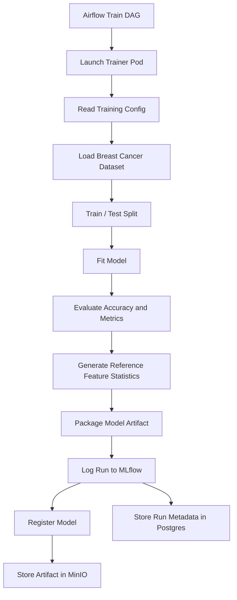
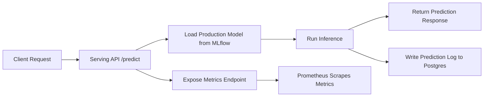
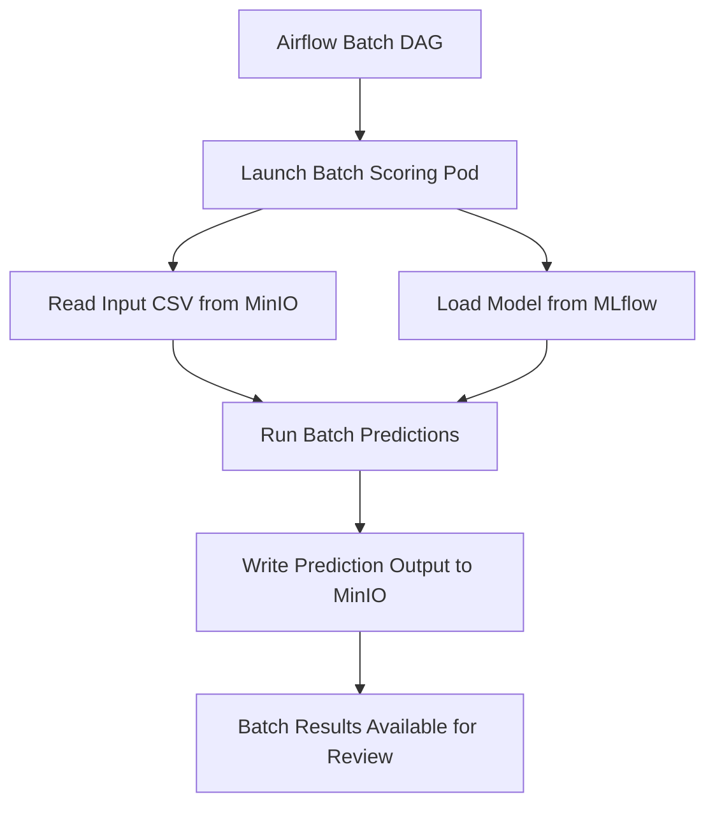
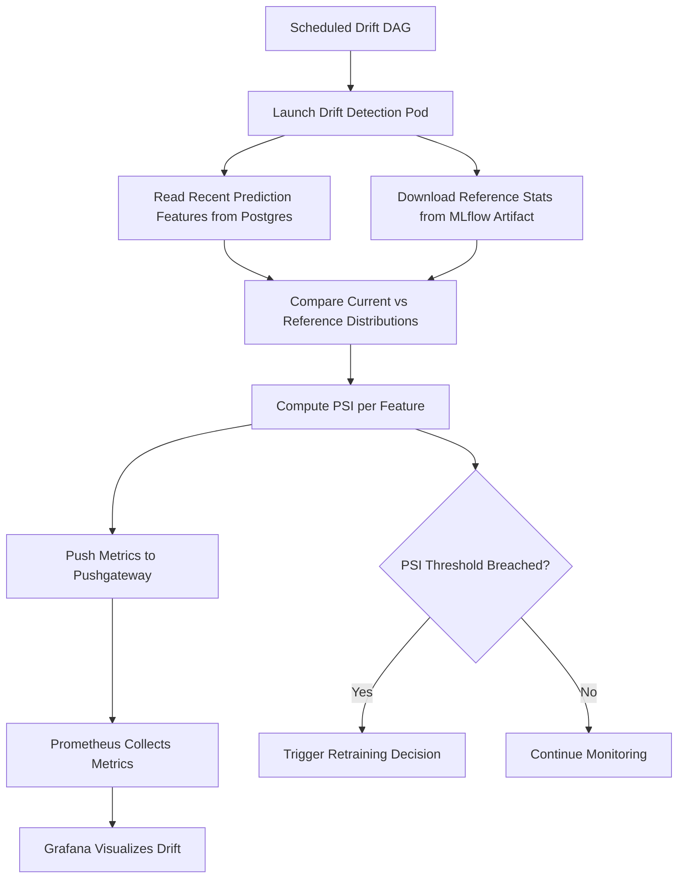

## Training Pipeline Diagram

```mermaid
flowchart TB

    A[Airflow Train DAG] --> B[Launch Trainer Pod]
    B --> C[Read Training Config]
    C --> D[Load Breast Cancer Dataset]
    D --> E[Train / Test Split]
    E --> F[Fit Model]
    F --> G[Evaluate Accuracy and Metrics]
    G --> H[Generate Reference Feature Statistics]
    H --> I[Package Model Artifact]
    I --> J[Log Run to MLflow]
    J --> K[Register Model]
    K --> L[Store Artifact in MinIO]
    J --> M[Store Run Metadata in Postgres]
```

## Real-Time Inference Flow

```mermaid
flowchart LR

    A[Client Request] --> B[Serving API /predict]
    B --> C[Load Production Model from MLflow]
    C --> D[Run Inference]
    D --> E[Return Prediction Response]
    D --> F[Write Prediction Log to Postgres]
    B --> G[Expose Metrics Endpoint]
    G --> H[Prometheus Scrapes Metrics]
```

## Batch Scoring Flow

```mermaid
flowchart TB

    A[Airflow Batch DAG] --> B[Launch Batch Scoring Pod]
    B --> C[Read Input CSV from MinIO]
    B --> D[Load Model from MLflow]
    C --> E[Run Batch Predictions]
    D --> E
    E --> F[Write Prediction Output to MinIO]
    F --> G[Batch Results Available for Review]
```

## Drift Detection Flow

```mermaid
flowchart TB

    A[Scheduled Drift DAG] --> B[Launch Drift Detection Pod]
    B --> C[Read Recent Prediction Features from Postgres]
    B --> D[Download Reference Stats from MLflow Artifact]
    C --> E[Compare Current vs Reference Distributions]
    D --> E
    E --> F[Compute PSI per Feature]
    F --> G[Push Metrics to Pushgateway]
    G --> H[Prometheus Collects Metrics]
    H --> I[Grafana Visualizes Drift]
    F --> J{PSI Threshold Breached?}
    J -->|Yes| K[Trigger Retraining Decision]
    J -->|No| L[Continue Monitoring]
```