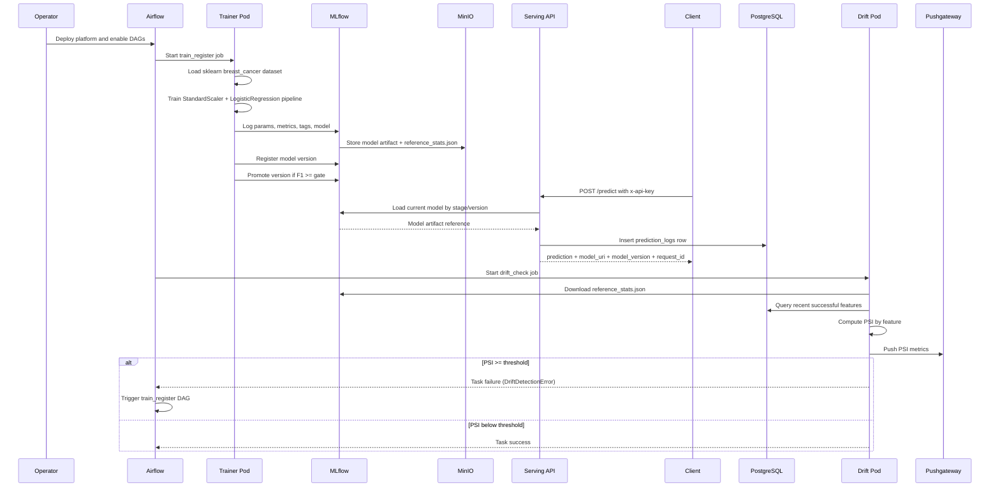
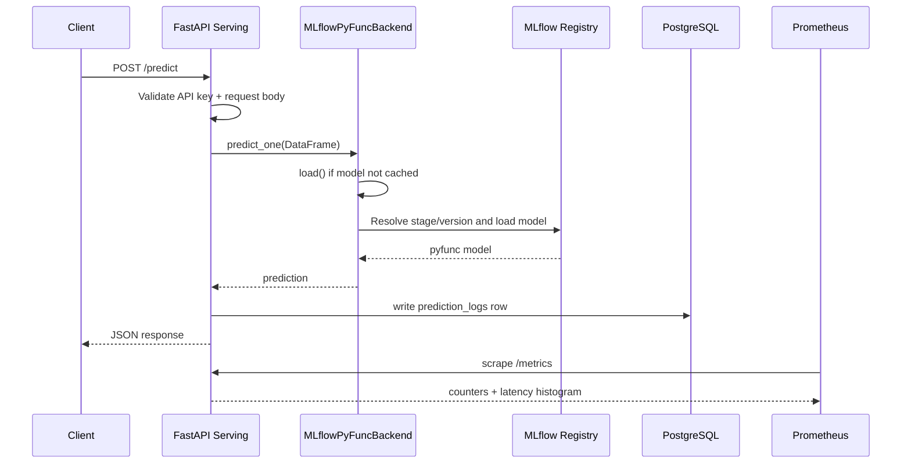
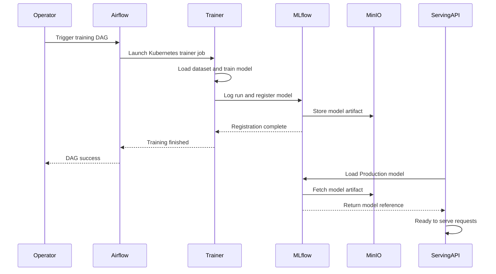
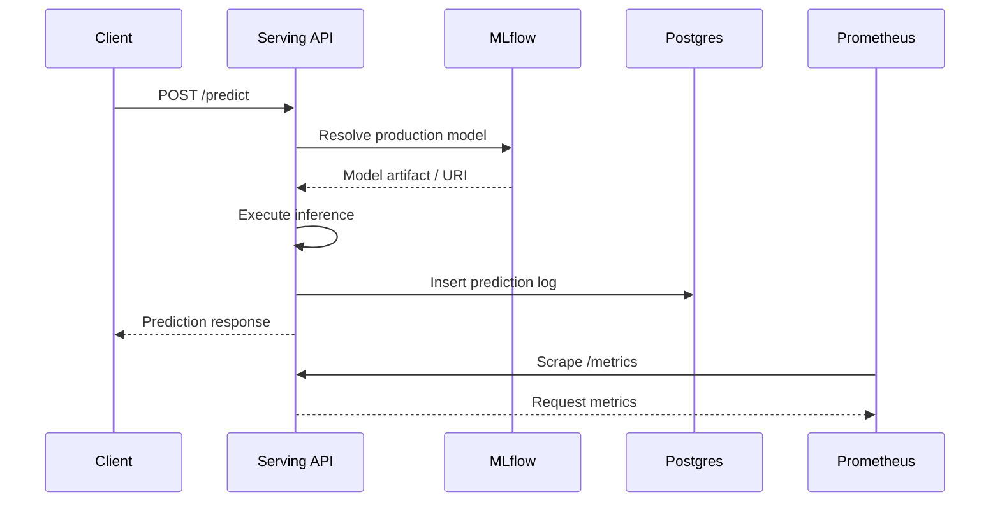
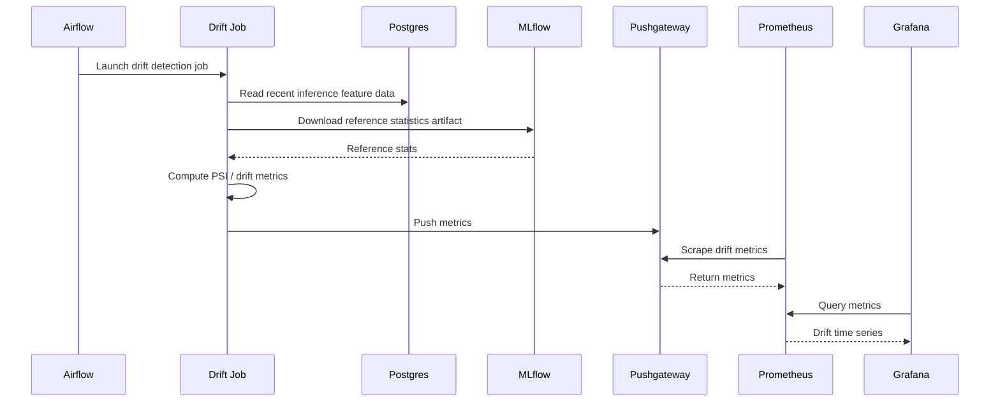

## Sequence Diagram: End-to-End Lifecycle 

---

## Sequence Diagram: Realtime Inference 

## Sequence Diagram: Training to Deployment

## Sequence Diagram: Prediction Request

## Sequence Diagram: Drift Monitoring Loop
